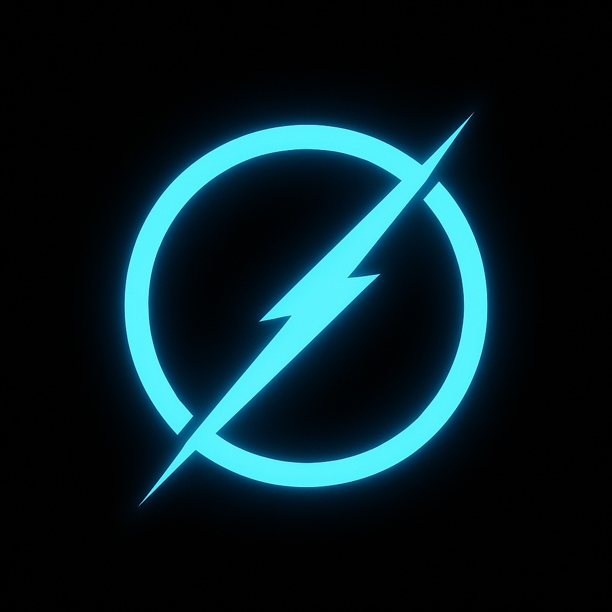

# ZeroGraph TypeScript

<div align="center">
  
</div>


[](https://badge.fury.io/js/@u0z/zero-graph)
[](https://www.typescriptlang.org/)

ZeroGraph TypeScript is a [minimalist](https://github.com/u-0-z/zero-graph/blob/main/src/index.ts) LLM framework designed for AI Agent programming

ZeroGraph is a TypeScript implementation of [PocketFlow](https://github.com/The-Pocket/PocketFlow) (Python), designed to collectively advance the development of agent-oriented LLM programming framework technologies and concepts.

- **Lightweight**: Just 100 lines. Zero bloat, zero dependencies, zero vendor lock-in.
- **Expressive**: Everything you love—([Multi-](https://u-zero.github.io/ZeroGraph/design_pattern/multi_agent.html))[Agents](https://u-zero.github.io/ZeroGraph/design_pattern/agent.html), [Workflow](https://u-zero.github.io/ZeroGraph/design_pattern/workflow.html), [RAG](https://u-zero.github.io/ZeroGraph/design_pattern/rag.html), and more.
- **TypeScript Native**: Full type safety and excellent IDE support.
- **[Agentic Coding](https://zacharyhuang.substack.com/p/agentic-coding-the-most-fun-way-to)**: Let AI Agents (e.g., Cursor AI) build Agents—10x productivity boost!

## Installation

```bash
npm install @u0z/zero-graph
```

Or with yarn:

```bash
yarn add @u0z/zero-graph
```

## Quick Start

```typescript
import { Node, Flow } from '@u0z/zero-graph';

// Define a simple node
class GreetingNode extends Node {
  prep(shared: any): string {
    return shared.name || 'World';
  }

  exec(name: string): string {
    return `Hello, ${name}!`;
  }

  post(shared: any, prepRes: string, execRes: string): void {
    shared.greeting = execRes;
  }
}

// Create and run a flow
const flow = new Flow(new GreetingNode());
const shared = { name: 'TypeScript' };

flow.run(shared);
console.log(shared.greeting); // "Hello, TypeScript!"
```

## Core Concepts

### Node

The basic building block that handles simple tasks:

```typescript
class MyNode extends Node {
  prep(shared: any): any {
    // Prepare data from shared store
    return shared.input;
  }

  exec(prepResult: any): any {
    // Execute the main logic
    return processData(prepResult);
  }

  post(shared: any, prepRes: any, execRes: any): string {
    // Store result and return next action
    shared.result = execRes;
    return 'default';
  }
}
```

### Flow

Orchestrates multiple nodes through actions:

```typescript
const nodeA = new NodeA();
const nodeB = new NodeB();
const nodeC = new NodeC();

// Connect nodes with actions
nodeA.next(nodeB, 'success');
nodeA.next(nodeC, 'error');

const flow = new Flow(nodeA);
flow.run(shared);
```

### Batch Processing

Process multiple items efficiently:

```typescript
class BatchProcessor extends BatchNode {
  exec(item: any): any {
    return processItem(item);
  }
}

const batchFlow = new BatchFlow(new BatchProcessor());
```

### Async Support

Handle asynchronous operations:

```typescript
class AsyncProcessor extends AsyncNode {
  async execAsync(input: any): Promise<any> {
    return await apiCall(input);
  }
}

const asyncFlow = new AsyncFlow(new AsyncProcessor());
await asyncFlow.runAsync(shared);
```

## Examples

Check out the [examples](./examples) directory for comprehensive usage examples:

- [Hello World](./examples/hello-world) - Basic node and flow usage
- [Agent](./examples/agent) - Research agent with web search
- [Workflow](./examples/workflow) - Multi-step content generation
- [Batch Processing](./examples/batch) - Handle multiple items
- [Async Operations](./examples/async) - Asynchronous workflows
- [RAG](./examples/rag) - Retrieval-augmented generation
- [Multi-Agent](./examples/multi-agent) - Multiple agents collaboration

## Documentation

- [Core Abstractions](./docs/core/) - Node, Flow, and Shared Store
- [Design Patterns](./docs/patterns/) - Agent, Workflow, RAG, etc.
- [API Reference](./docs/api/) - Complete API documentation
- [Migration Guide](./docs/migration/) - From Python to TypeScript

## Why ZeroGraph TypeScript?

Current LLM frameworks are bloated... You only need 100 lines for LLM Framework!

|               | **Lines** | **Size**  | **TypeScript** |
| ------------- | :-------: | :-------: | :------------: |
| LangChain     |   405K    |  +166MB   |       ❌       |
| CrewAI        |    18K    |  +173MB   |       ❌       |
| LangGraph     |    37K    |   +51MB   |       ❌       |
| **ZeroGraph** |  **100**  | **+56KB** |     **✅**     |

## Contributing

We welcome contributions! Please see our [Contributing Guide](CONTRIBUTING.md) for details.

## License

MIT License - see [LICENSE](LICENSE) file for details.

## Links

- [Python Version](https://github.com/u-0-z/ZeroGraph)
- [Documentation](https://u-zero.github.io/ZeroGraph/)
- [Blog](https://u0z.medium.com/)
