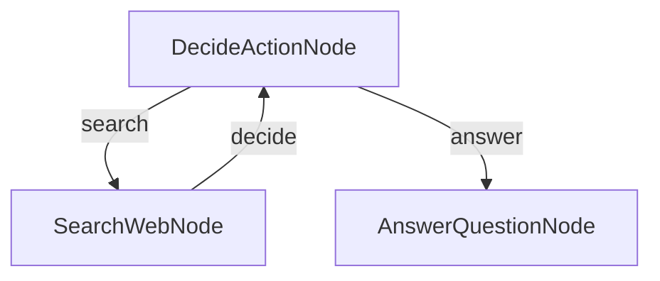

# Research Agent

This project demonstrates a simple yet powerful LLM-powered research agent built with ZeroGraph TypeScript.

## Features

- Performs web searches to gather information
- Makes decisions about when to search vs. when to answer
- Generates comprehensive answers based on research findings

## Getting Started

1. Install dependencies:

```bash
npm install
```

2. Run the agent with the default question:

```bash
npm run dev
```

## How It Works

The agent uses a simple but powerful graph structure with three main components:



### Node Breakdown

1. **DecideActionNode**: The brain that figures out whether to search or answer
   - Analyzes the current question and available search results
   - Decides whether more information is needed

2. **SearchWebNode**: The researcher that goes out and finds information
   - Performs web searches based on the question
   - Accumulates search results in the shared store

3. **AnswerQuestionNode**: The writer that crafts the final answer
   - Uses all gathered search results to generate a comprehensive answer

## Example Output

```
=== Starting Research Agent ===
Question: What are the recent developments in quantum computing?

Decision: search
Searching web for: What are the recent developments in quantum computing?
Found 3 new results
Decision: answer
Final answer generated

=== Final Result ===
Answer: Mock LLM response to: Based on the following search results, answer the question:
...
```

## Key Concepts Illustrated

- **Agent Pattern**: Autonomous decision-making through node connections
- **Conditional Flow**: Different paths based on node decisions
- **State Accumulation**: Building up information over multiple iterations
- **Feedback Loops**: Returning to previous nodes for iterative improvement

## Customization

You can easily customize the agent by:

1. **Modifying Decision Logic**: Change how `DecideActionNode` makes decisions
2. **Adding Search Sources**: Extend `SearchWebNode` to use different search APIs
3. **Improving Answer Generation**: Enhance `AnswerQuestionNode` with better prompts
4. **Adding More Nodes**: Insert additional processing steps in the flow

## Next Steps

- Implement real LLM API calls (OpenAI, Anthropic, etc.)
- Add real web search functionality (Google, Bing, etc.)
- Implement proper error handling and retries
- Add logging and monitoring capabilities
