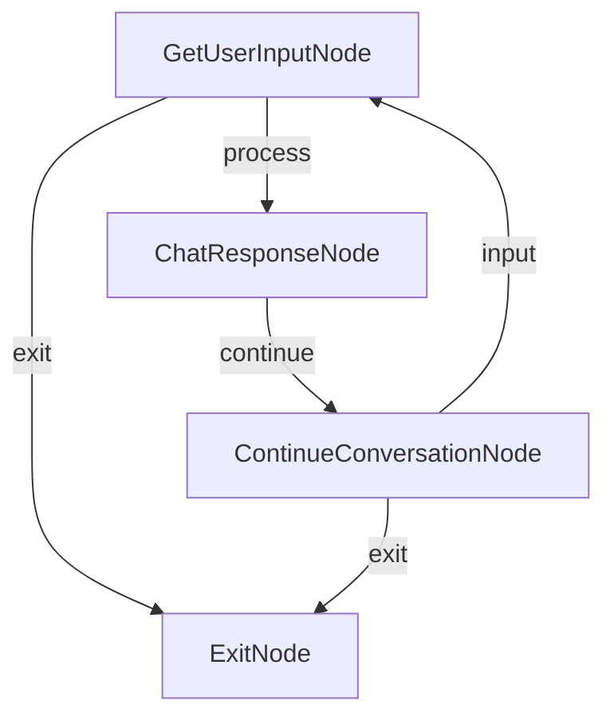

# ZeroGraph Async Chat - Complete Single File Example

A fully self-contained asynchronous chat application using ZeroGraph framework with OpenAI integration, designed for vm2 environments.

## 🌟 Features

- **Single file implementation**: All code in one JavaScript file with no external dependencies
- **vm2 compatible**: Designed for server-side vm2 sandbox environments
- **Async chat flow**: Complete conversation loop with context memory
- **OpenAI integration**: Built-in simplified OpenAI API client
- **Error handling**: Built-in retry mechanisms and fallback strategies
- **Conversation history**: Automatic conversation context management (up to 5 exchanges)

## 🚀 Quick Start

### Method 1: Direct execution

```bash
# Ensure you have Node.js environment
node examples/async-chat-complete/index.js
```

### Method 2: With OpenAI API Key

```bash
# Set environment variable
export OPENAI_API_KEY="your-actual-api-key-here"

# Run the example
node examples/async-chat-complete/index.js
```

### Method 3: In vm2 environment

```javascript
const vm = require('vm2');
const fs = require('fs');

// Read the single file code
const code = fs.readFileSync('examples/async-chat-complete/index.js', 'utf8');

// Run in vm2
const vm2Instance = new vm.VM({
  timeout: 60000,
  sandbox: {
    console,
    setTimeout,
    setInterval,
    clearTimeout,
    clearInterval,
    fetch: require('node-fetch'), // if needed
    process: { env: { OPENAI_API_KEY: 'your-key' } },
  },
});

vm2Instance.run(code);
```

## 💬 Usage Example

After running, you'll see a conversation like this:

```
🚀 Welcome to ZeroGraph Async Chat!
This is a complete single-file JavaScript implementation designed for vm2 environments.
Type "exit" or "quit" to end the conversation.

💡 Starting chat session...

💬 You: Hello, how are you today?
🤖 Assistant: Hello! I'm doing well, thank you for asking. I'm here and ready to help you with any questions or tasks you might have. How are you doing today?

💬 You: Can you write a poem about spring?
🤖 Assistant: Of course! Here's a poem about spring:

Spring awakens with gentle grace,
Flowers bloom in every place.
Cherry blossoms dance in breeze,
New life stirs in budding trees.

Warm sunshine melts winter's hold,
Stories of rebirth unfold.
Birds return with joyful song,
Days grow bright and sweet and long.

Hope renewed in every heart,
Spring gives nature a fresh start.

I hope you enjoyed this spring poem!

💬 You: exit

👋 Thanks for chatting! Goodbye!

✅ Chat session completed.
```

## 🏗️ Architecture Design

### Core Components

#### 1. ZeroGraph Framework Core Classes

- `BaseNode`: Base class for all nodes
- `Node`: Basic node with retry mechanisms
- `AsyncNode`: Asynchronous operation nodes
- `Flow`: Basic flow orchestration class
- `AsyncFlow`: Asynchronous flow orchestration

#### 2. OpenAI Integration

- `SimpleOpenAI`: Simplified OpenAI client (no openai library required)
- `callLLM()`: Convenient LLM calling function
- `getUserInput()`: User input handling

#### 3. Chat Application Nodes

- `GetUserInputNode`: Handles user input
- `ChatResponseNode`: Generates AI responses
- `ContinueConversationNode`: Controls conversation flow
- `ExitNode`: Handles exit processing

### Flow Diagram



## 🔧 Configuration Options

### OpenAI Configuration

You can configure OpenAI through environment variables or by directly modifying the code:

```javascript
// Environment variable method
process.env.OPENAI_API_KEY = 'your-key-here';

// Or modify the SimpleOpenAI constructor in code
class SimpleOpenAI {
  constructor(config = {}) {
    this.apiKey = config.apiKey || 'your-key-here';
    this.baseURL = config.baseURL || 'https://api.openai.com/v1';
    this.model = config.model || 'gpt-3.5-turbo';
  }
}
```

### Conversation Parameter Adjustment

In `ChatResponseNode.execAsync()`:

```javascript
const response = await callLLM(prompt, {
  maxTokens: 200, // Maximum tokens to generate
  temperature: 0.8, // Creativity level (0-1)
});
```

## 🛡️ vm2 Environment Notes

### 1. Dependency Management

This single file contains all necessary code with no external npm packages required.

### 2. API Access

Ensure the vm2 sandbox allows:

- `fetch` API (for OpenAI calls)
- `setTimeout/setInterval` (for retry mechanisms)
- `console` object (for logging)

### 3. Input Handling

In restricted vm2 environments, the `getUserInput` function may need to be replaced with an appropriate input method.

## 🔄 Extension Examples

### Adding New Chat Features

```javascript
class TranslateNode extends AsyncNode {
  async execAsync(input) {
    const { text, targetLang } = input;
    const prompt = `Translate the following text to ${targetLang}: ${text}`;
    return await callLLM(prompt);
  }
}
```

### Modifying Conversation Flow

```javascript
function createCustomChatFlow() {
  const input = new GetUserInputNode();
  const translate = new TranslateNode();
  const response = new ChatResponseNode();

  input.next(translate, 'translate');
  input.next(response, 'chat');

  return new AsyncFlow(input);
}
```

## 🐛 Troubleshooting

### 1. API Errors

If OpenAI API calls fail, the system automatically falls back to mock responses:

```
Mock response to: You are a helpful AI assistant...
```

### 2. Input Issues

In vm2 environments, if `readline` is unavailable, the system uses default input:

```
Hello from vm2 environment
```

### 3. Memory Management

Conversation history is automatically limited to the last 5 exchanges to prevent context overflow.

## 📊 Performance Characteristics

- **File size**: ~15KB single file
- **Memory usage**: Lightweight, suitable for resource-constrained environments
- **Response time**: Depends on OpenAI API latency
- **Concurrency support**: Single conversation session, extensible to multi-session

## 🔗 Related Resources

- [ZeroGraph Core Documentation](../../docs/)
- [Other JavaScript Examples](../../examples/)
- [Python PocketFlow Project](../../python/)
- [OpenAI API Documentation](https://platform.openai.com/docs/)

## 📝 License

MIT License - see [LICENSE](../../LICENSE) for details.
