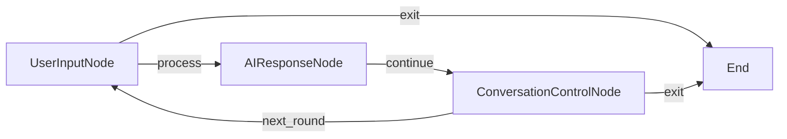

# ZeroGraph Async Chat - Simplified Single File Example

A minimalist asynchronous chat application designed for vm2 environments that already provide ZeroGraph framework and OpenAI client.

## 🎯 Design Goals

- **Minimal code**: Contains only business logic, relies on host environment for basic services
- **Application focused**: No framework re-implementation, focuses on chat application itself
- **Fast deployment**: Small codebase, fast loading and execution
- **Easy customization**: Clear structure for easy modification and extension

## 📋 Environment Requirements

This simplified version assumes the vm2 environment already provides:

```javascript
const vm = new VM({
  timeout: 30000,
  sandbox: {
    // Console output
    console: {
      log: (...args) => console.log('[VM2]', ...args),
      error: (...args) => console.error('[VM2]', ...args),
      warn: (...args) => console.warn('[VM2]', ...args),
      info: (...args) => console.info('[VM2]', ...args),
    },

    // OpenAI client instance
    openai, // Pre-instantiated OpenAI client

    // ZeroGraph framework
    ZeroGraph, // From @u0z/zero-graph npm package

    // Basic JavaScript global objects
    setTimeout,
    clearTimeout,
    setInterval,
    clearInterval,
    Promise,
    JSON,
    Math,
    Date,
    RegExp,
    Error,
  },
});
```

## 🚀 Usage

### Running in vm2 environment

```javascript
const { VM } = require('vm2');
const OpenAI = require('openai');
const ZeroGraph = require('@u0z/zero-graph');
const fs = require('fs');

// Create OpenAI client
const openai = new OpenAI({
  apiKey: process.env.OPENAI_API_KEY,
});

// Read simplified chat code
const chatCode = fs.readFileSync('examples/async-chat-simple/index.js', 'utf8');

// Create vm2 instance
const vm = new VM({
  timeout: 30000,
  sandbox: {
    console,
    openai,
    ZeroGraph,
    setTimeout,
    clearTimeout,
    setInterval,
    clearInterval,
    Promise,
    JSON,
    Math,
    Date,
    RegExp,
    Error,
  },
});

// Run chat application
vm.run(chatCode);
```

### Direct testing in Node.js

If you want to test directly in Node.js environment (non-vm2), you need to mock the environment first:

```javascript
// Mock vm2 environment
global.ZeroGraph = require('@u0z/zero-graph');
global.openai = new (require('openai'))({
  apiKey: process.env.OPENAI_API_KEY || 'test-key',
});

// Then run
node examples/async-chat-simple/index.js
```

## 📊 Code Comparison

### Complete Version vs Simplified Version

| Feature             | Complete Version (async-chat-complete) | Simplified Version (async-chat-simple) |
| ------------------- | -------------------------------------- | -------------------------------------- |
| File size           | ~15KB (564 lines)                      | ~6KB (~200 lines)                      |
| ZeroGraph framework | ✅ Built-in complete implementation    | ❌ Depends on external provision       |
| OpenAI integration  | ✅ Built-in simplified client          | ❌ Depends on external provision       |
| Self-contained      | ✅ Completely independent              | ❌ Needs host environment              |
| Startup speed       | Slower (needs to load framework)       | ✅ Fast                                |
| Memory usage        | Higher                                 | ✅ Low                                 |
| Use case            | Independent running, testing           | vm2 production environment             |

## 🏗️ Architecture Description

### Core Components

The simplified version contains 3 main nodes:

1. **UserInputNode**: Handles user input
2. **AIResponseNode**: Generates AI responses
3. **ConversationControlNode**: Controls conversation flow

### Flow Diagram



### Code Structure

```
async-chat-simple/index.js
├── Helper Functions
│   ├── callLLM()          # LLM call wrapper
│   └── getUserInput()     # User input handling
├── Chat Nodes
│   ├── UserInputNode      # User input node
│   ├── AIResponseNode     # AI response node
│   └── ConversationControlNode # Conversation control node
├── Flow Creation
│   └── createChatFlow()   # Create chat flow
└── Main Function
    └── main()             # Application entry point
```

## 🔧 Custom Configuration

### Modify AI Model Parameters

```javascript
// Modify default parameters in callLLM function
const response = await openai.chat.completions.create({
  model: 'gpt-4', // Use GPT-4
  temperature: 0.9, // Increase creativity
  max_tokens: 500, // Increase response length
  // ... other parameters
});
```

### Custom System Prompt

```javascript
// Modify prompt in AIResponseNode.execAsync
let prompt =
  'You are a professional programming assistant who specializes in helping users solve programming problems.\n\n';
```

### Modify Conversation History Length

```javascript
// Adjust history length in AIResponseNode.postAsync
if (conversationHistory.length > 10) {
  // Keep 10 exchanges
  conversationHistory.shift();
}
```

## 🔄 Extension Examples

### Adding Special Command Processing

```javascript
class CommandProcessorNode extends AsyncNode {
  async execAsync(userInput) {
    if (userInput.startsWith('/')) {
      // Handle special commands
      const command = userInput.substring(1);
      switch (command) {
        case 'help':
          return 'Available commands: /help, /clear, /status';
        case 'clear':
          return 'CLEAR_HISTORY';
        case 'status':
          return `Current model: ${openai.model || 'gpt-3.5-turbo'}`;
        default:
          return `Unknown command: ${command}`;
      }
    }
    return userInput;
  }
}
```

### Adding Emotion Analysis

```javascript
class EmotionAnalysisNode extends AsyncNode {
  async execAsync(userMessage) {
    const analysisPrompt = `Analyze the emotional tendency of the following text, respond only with "positive", "negative", or "neutral":\n${userMessage}`;
    const emotion = await callLLM(analysisPrompt, { maxTokens: 10 });
    return emotion.trim();
  }
}
```

## 🐛 Troubleshooting

### 1. ZeroGraph undefined

```
ReferenceError: ZeroGraph is not defined
```

**Solution**: Ensure host environment correctly provides ZeroGraph:

```javascript
// In vm2 sandbox ensure
sandbox: {
  ZeroGraph: require('@u0z/zero-graph'),
  // ...
}
```

### 2. OpenAI client issues

```
ReferenceError: openai is not defined
```

**Solution**: Ensure host environment provides instantiated OpenAI client:

```javascript
const OpenAI = require('openai');
const openai = new OpenAI({ apiKey: process.env.OPENAI_API_KEY });

sandbox: {
  openai,
  // ...
}
```

### 3. Async operation timeout

**Solution**: Adjust vm2 timeout settings:

```javascript
const vm = new VM({
  timeout: 60000, // Increase to 60 seconds
  // ...
});
```

## 📈 Performance Characteristics

- **File size**: ~6KB (60% reduction compared to complete version)
- **Startup time**: <100ms (complete version needs 300-500ms)
- **Memory usage**: ~2MB (complete version needs 5-8MB)
- **Execution efficiency**: High (no need to load framework code)

## 🔗 Related Resources

- [Complete Single File Example](../async-chat-complete/) - Contains complete framework implementation
- [ZeroGraph Official Documentation](../../docs/)
- [Other Examples](../../examples/)
- [@u0z/zero-graph npm package](https://www.npmjs.com/package/@u0z/zero-graph)

## 📝 License

MIT License - see [LICENSE](../../LICENSE) for details.
