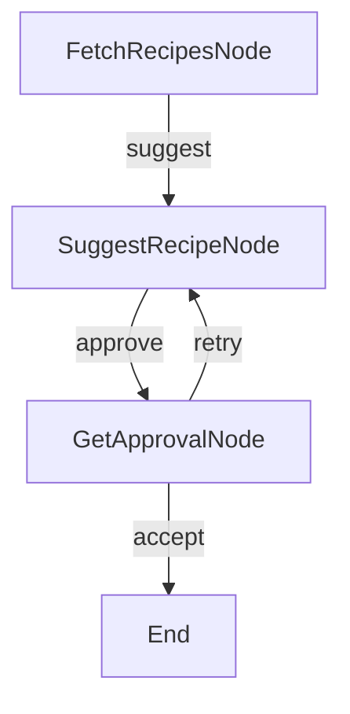

# ZeroGraph Async Example

This example demonstrates async operations using a Recipe Finder that:

1. Fetches recipes from an API (async HTTP)
2. Processes them with an LLM (async LLM)
3. Waits for user confirmation (async input)

## What this Example Does

When you run the example:

1. You enter an ingredient (e.g., "chicken")
2. It searches for recipes (async API call)
3. It suggests a recipe (async LLM call)
4. You approve or reject the suggestion
5. If rejected, it tries again with a different recipe

## Getting Started

1. Install dependencies:

```bash
npm install
```

2. Run the example:

```bash
npm run dev
```

## How it Works

The example uses three main AsyncNodes:

1. **FetchRecipesNode (AsyncNode)**

   ```typescript
   async prepAsync(shared: SharedStore): Promise<string> {
     const ingredient = shared.ingredient || 'chicken';
     return ingredient;
   }

   async execAsync(ingredient: string): Promise<string[]> {
     // Async API call
     const recipes = await fetchRecipes(ingredient);
     return recipes;
   }
   ```

2. **SuggestRecipeNode (AsyncNode)**

   ```typescript
   async execAsync(recipes: string[]): Promise<string> {
     // Async LLM call
     const suggestion = await callLLMAsync(
       `Choose best recipe from: ${recipes}`
     );
     return suggestion;
   }
   ```

3. **GetApprovalNode (AsyncNode)**
   ```typescript
   async postAsync(shared: SharedStore, prepRes: string, execRes: string): Promise<string> {
     // Async user input
     const answer = await getUserInput(
       `Accept ${suggestion}? (y/n): `
     );
     return answer === 'y' ? 'accept' : 'retry';
   }
   ```

## Flow Structure



## Example Output

```
=== Starting Async Recipe Finder ===
Looking for recipes with: chicken

Fetching recipes for: chicken
Found 4 recipes

Suggesting: chicken stir fry
Accept "chicken stir fry"? (y/n):
n
✗ Let's try another recipe...

Suggesting: Grilled chicken
Accept "Grilled chicken"? (y/n):
y
✓ Great choice! You selected: Grilled chicken

=== Final Result ===
Final choice: Grilled chicken
Total time: 1247ms
```

## Key Concepts

1. **Async Operations**: Using `async/await` for:
   - API calls (non-blocking I/O)
   - LLM calls (potentially slow)
   - User input (waiting for response)

2. **Async Flow**: The `AsyncFlow` class manages async node execution

3. **Async Node Lifecycle**:
   - `prepAsync()`: Prepare data asynchronously
   - `execAsync()`: Execute main logic asynchronously
   - `postAsync()`: Process results and determine next action

4. **Error Handling**: Built-in retry mechanism with async support

## Real-World Applications

This pattern is perfect for:

- API integrations with external services
- Database operations
- File I/O operations
- User interaction flows
- LLM API calls
- Image/video processing

## Performance Benefits

Async operations allow:

- Non-blocking I/O operations
- Better resource utilization
- Improved user experience
- Concurrent processing capabilities

## Next Steps

- Try [parallel async processing](../parallel-async) for concurrent operations
- Check out [async batch processing](../async-batch) for handling multiple items
- Explore [real LLM integration](../llm-integration) with actual APIs
