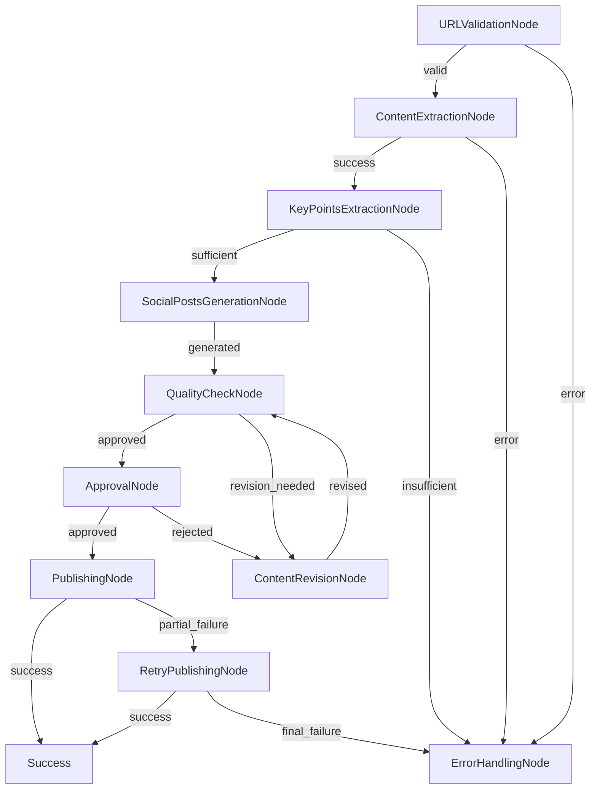

# Social Media Post Generation Agent

A comprehensive social media post generation agent built with ZeroGraph framework that transforms articles into engaging social media posts for multiple platforms.

## Features

- **URL Validation**: Validates article URLs before processing
- **Content Extraction**: Fetches and extracts article content from URLs
- **Key Points Extraction**: Uses LLM to identify main points from articles
- **Multi-Platform Post Generation**: Creates posts for Twitter, Medium, and Reddit
- **Quality Control**: Validates posts meet platform-specific requirements
- **Content Revision**: Automatically revises posts that fail quality checks
- **Approval Process**: Final approval gate before publishing
- **Publishing**: Publishes posts to social media platforms
- **Retry Mechanism**: Handles failed publications with retry logic
- **Error Handling**: Comprehensive error handling throughout the workflow

## Architecture

The agent follows the workflow diagram from `design.md` and implements the following nodes:

### Core Nodes

1. **URLValidationNode**: Validates input URL format and accessibility
2. **ContentExtractionNode**: Fetches article content from URL
3. **KeyPointsExtractionNode**: Extracts key points using LLM
4. **SocialPostsGenerationNode**: Generates platform-specific posts
5. **QualityCheckNode**: Validates posts meet quality standards
6. **ContentRevisionNode**: Revises posts based on quality issues
7. **ApprovalNode**: Final approval before publishing
8. **PublishingNode**: Publishes posts to social media platforms
9. **RetryPublishingNode**: Handles retry logic for failed publications
10. **ErrorHandlingNode**: Handles various error scenarios

### Flow Diagram



## Installation

1. Install dependencies:

```bash
npm install
```

2. Set up environment variables (for real implementation):

```bash
export OPENAI_API_KEY="your-openai-api-key"
export TWITTER_API_KEY="your-twitter-api-key"
export MEDIUM_API_KEY="your-medium-api-key"
export REDDIT_API_KEY="your-reddit-api-key"
```

## Usage

### Basic Usage

```bash
npm run dev
```

### Programmatic Usage

```typescript
import { createSocialMediaAgentFlow } from './index';

const shared = {
  articleURL: 'https://example.com/your-article',
  articleContent: null,
  keyPoints: null,
  socialPosts: null,
  publishResults: null,
  error: null,
  finalStatus: null,
};

const agentFlow = createSocialMediaAgentFlow();
const result = await agentFlow.runAsync(shared);

console.log('Final result:', result);
console.log('Generated posts:', shared.socialPosts);
```

## External API Requirements

The agent requires the following external APIs to be implemented and injected into the vm2 environment:

### 1. URL Validation

```typescript
function validateURL(url: string): boolean;
```

- Validates URL format and accessibility
- Returns true if URL is valid, false otherwise

### 2. Content Extraction

```typescript
async function fetchArticleContent(url: string): Promise<string | null>;
```

- Fetches and extracts article content from URL
- Recommended libraries: puppeteer, cheerio, readability
- Returns extracted text or null if failed

### 3. LLM Integration

```typescript
async function callLLM(prompt: string): Promise<string>;
```

- Calls Language Model API (OpenAI, Anthropic, etc.)
- Processes prompts for key point extraction and post generation
- Returns LLM response

### 4. Social Media Publishing

```typescript
async function publishToSocialMedia(
  platform: string,
  content: string
): Promise<boolean>;
```

- Publishes content to specific social media platform
- Supported platforms: twitter, medium, reddit
- Returns true if successful, false otherwise

## Platform-Specific Features

### Twitter

- Character limit validation (280 characters)
- Hashtag requirement checking
- URL shortening support

### Medium

- Markdown formatting support
- Minimum length validation (200 characters)
- Header structure validation

### Reddit

- Casual tone optimization
- Discussion point generation
- Minimum length validation (100 characters)

## Quality Control

The agent implements comprehensive quality control:

1. **Content Validation**: Ensures extracted content is sufficient
2. **Length Checks**: Platform-specific length requirements
3. **Format Validation**: Hashtags, headers, and structure
4. **Revision Loop**: Automatic content revision for failed checks
5. **Approval Gate**: Final human/automated approval

## Error Handling

The agent handles various error scenarios:

- Invalid URLs
- Content extraction failures
- Insufficient key points
- Quality check failures
- Publishing failures
- Network timeouts
- API rate limits

## VM2 Integration

For vm2 environments, inject the required external functions:

```javascript
const { VM } = require('vm2');
const agentCode = fs.readFileSync('index.ts', 'utf8');

const vm = new VM({
  sandbox: {
    console,
    validateURL: url => {
      /* implementation */
    },
    fetchArticleContent: async url => {
      /* implementation */
    },
    callLLM: async prompt => {
      /* implementation */
    },
    publishToSocialMedia: async (platform, content) => {
      /* implementation */
    },
    setTimeout,
    Promise,
    JSON,
  },
});

vm.run(agentCode);
```

## Configuration

The agent can be configured through the SharedStore:

```typescript
const shared = {
  articleURL: 'https://example.com/article',
  maxRetries: 3,
  platforms: ['twitter', 'medium', 'reddit'],
  qualityThreshold: 0.8,
  autoApprove: false,
};
```

## Testing

The current implementation includes mock functions for testing:

```bash
npm run dev  # Runs with mock implementations
```

For production use, replace mock functions with actual API implementations.

## Contributing

1. Fork the repository
2. Create a feature branch
3. Make your changes
4. Add tests
5. Submit a pull request

## License

MIT License - see LICENSE file for details.

## Support

For issues and questions:

- Create an issue in the GitHub repository
- Check the ZeroGraph documentation
- Join the community Discord

---

Built with ❤️ using [ZeroGraph](https://github.com/u-0-z/zero-graph) framework.
