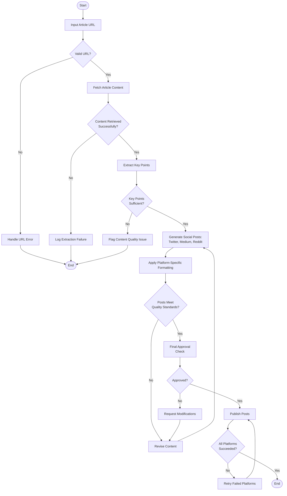

Here's the detailed business workflow diagram for processing articles into social media posts using mermaid syntax:

### Workflow Explanation:

1. **Start** with article URL input
2. **Decision Points** (Diamonds):
   - Validate URL structure
   - Verify content retrieval success
   - Ensure key points are actionable
   - Quality check formatted posts
   - Final approval gate
   - Post-publication verification
3. **Key Steps**:
   - Content extraction from URL
   - Key point identification
   - Platform-specific post generation
   - Quality assurance and approval
   - Error handling at critical stages
   - Post-retry mechanism
4. **End Points**:
   - Successful publication on all platforms
   - Error termination at critical failures

This workflow includes quality control loops (steps O→K and U→S) to ensure outputs meet standards before final publication. Error handling occurs at each decision node to prevent process failures.
