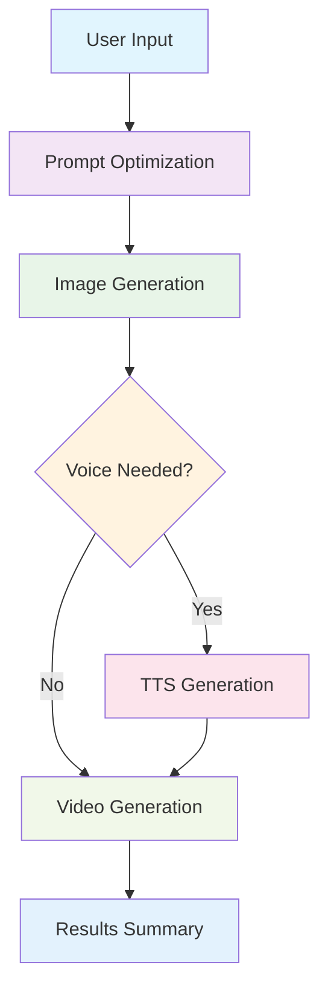
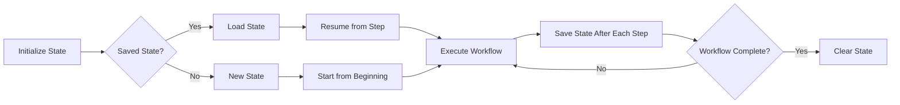

# Stateful Video Generation Workflow

A comprehensive example demonstrating a stateful video generation workflow with state persistence and resumable execution capabilities using ZeroGraph.

## 🎯 Overview

This workflow creates a complete video generation pipeline that can:

1. **Accept user prompts** for video generation
2. **Optimize prompts** using LLM interfaces
3. **Determine voice requirements** based on content analysis
4. **Generate images** using text-to-image models
5. **Generate audio** using text-to-speech (when needed)
6. **Create final videos** using digital character models
7. **Persist state** to external storage
8. **Resume execution** from any step if interrupted

## 🌟 Key Features

### State Persistence

- **External storage integration** for workflow state
- **Resumable execution** from any step
- **Progress tracking** with completion percentage
- **Error recovery** with state restoration

### Workflow Capabilities

- **LLM prompt optimization** with voice detection
- **Conditional branching** based on voice requirements
- **Multi-step content generation** pipeline
- **Comprehensive result aggregation**

### Production Ready

- **vm2 environment compatibility**
- **External API injection** support
- **Mock implementations** for testing
- **Error handling** and fallback mechanisms

## 📁 Project Structure

```
stateful-video-workflow/
├── index.ts              # Main application entry point
├── state-persistence.ts  # State management utilities
├── workflow-nodes.ts     # Individual workflow step nodes
├── workflow-flow.ts      # Flow orchestration and management
├── package.json          # Project dependencies
└── README.md            # This documentation
```

## 🚀 Quick Start

### Installation

```bash
cd examples/stateful-video-workflow
npm install
```

### Basic Usage

```bash
# Run the complete workflow demo
npm run demo

# Demonstrate workflow resumption
npm run demo:resumption

# Development mode with auto-reload
npm run dev
```

## 🔧 How It Works

### Workflow Steps



### State Management Flow



## 💻 Code Examples

### Basic Workflow Execution

```typescript
import { SharedStore } from '@u0z/zero-graph';
import { createStateManager } from './state-persistence';
import { createStatefulVideoWorkflow } from './workflow-flow';

// Create state manager with external persistence
const stateManager = createStateManager(
  saveStateFn, // External save function
  loadStateFn, // External load function
  clearStateFn // External clear function
);

// Create workflow
const workflow = createStatefulVideoWorkflow(stateManager);

// Initialize shared store
const shared: SharedStore = {
  userPrompt: null,
  optimizedPrompt: null,
  needsVoice: false,
  voiceText: null,
  imageUrl: null,
  audioUrl: null,
  videoUrl: null,
};

// Run workflow
const result = await workflow.runWorkflow(shared);
```

### Custom State Persistence

```typescript
import { WorkflowState } from './state-persistence';

// Database-based persistence
async function saveToDatabase(state: WorkflowState): Promise<void> {
  await database.save('workflow_state', state);
}

async function loadFromDatabase(): Promise<WorkflowState | null> {
  return await database.load('workflow_state');
}

async function clearFromDatabase(): Promise<void> {
  await database.delete('workflow_state');
}

// Create state manager with database persistence
const stateManager = createStateManager(
  saveToDatabase,
  loadFromDatabase,
  clearFromDatabase
);
```

### vm2 Environment Integration

```javascript
const { VM } = require('vm2');
const fs = require('fs');

// Read workflow code
const workflowCode = fs.readFileSync('index.ts', 'utf8');

// Create vm2 instance with external APIs
const vm = new VM({
  timeout: 60000,
  sandbox: {
    console,
    setTimeout,
    setInterval,
    clearTimeout,
    clearInterval,
    Promise,
    JSON,
    Date,
    Math,

    // External API functions
    optimizePrompt: async prompt => {
      // Your LLM optimization implementation
      return await llmService.optimize(prompt);
    },

    generateImage: async prompt => {
      // Your image generation implementation
      return await imageService.generate(prompt);
    },

    generateTTS: async text => {
      // Your TTS implementation
      return await ttsService.generate(text);
    },

    generateVideo: async (imageUrl, audioUrl) => {
      // Your video generation implementation
      return await videoService.generate(imageUrl, audioUrl);
    },

    // State persistence functions
    saveState: async state => {
      await fs.writeFile('workflow-state.json', JSON.stringify(state));
    },

    loadState: async () => {
      try {
        const data = await fs.readFile('workflow-state.json', 'utf8');
        return JSON.parse(data);
      } catch {
        return null;
      }
    },

    clearState: async () => {
      await fs.unlink('workflow-state.json').catch(() => {});
    },
  },
});

// Run workflow in vm2
vm.run(workflowCode);
```

## 🔌 External API Requirements

The workflow requires the following external APIs to be implemented and injected:

### State Persistence APIs

```typescript
// Save workflow state to external storage
async function saveState(state: WorkflowState): Promise<void>;

// Load workflow state from external storage
async function loadState(): Promise<WorkflowState | null>;

// Clear workflow state from external storage
async function clearState(): Promise<void>;
```

### AI Model APIs

```typescript
// Optimize user prompt using LLM
async function optimizePrompt(prompt: string): Promise<{
  optimizedPrompt: string;
  needsVoice: boolean;
  voiceText?: string;
}>;

// Generate image from text prompt
async function generateImage(prompt: string): Promise<string>; // Returns image URL

// Generate audio from text using TTS
async function generateTTS(text: string): Promise<string>; // Returns audio URL

// Generate video from image and optional audio
async function generateVideo(
  imageUrl: string,
  audioUrl?: string
): Promise<string>; // Returns video URL
```

## 📊 Workflow State Structure

```typescript
interface WorkflowState {
  currentStep: string;           // Current workflow step
  completedSteps: string[];      // List of completed steps
  timestamp: number;             // Last update timestamp
  data: SharedStore;             // Workflow data
}

// Example state
{
  currentStep: "image_generation",
  completedSteps: ["user_input", "prompt_optimization"],
  timestamp: 1704067200000,
  data: {
    userPrompt: "Create a video about a peaceful sunset...",
    optimizedPrompt: "Enhanced cinematic prompt: ...",
    needsVoice: true,
    voiceText: "Professional narration for: ..."
  }
}
```

## 🎮 Usage Examples

### Running the Demo

```bash
# Basic workflow execution
npm run demo

# Expected output:
# 🎬 Stateful Video Generation Workflow
# =====================================
# 🆕 Starting new workflow session
# 💬 Please enter your prompt for video generation:
# 📝 User prompt: Create a video about a peaceful sunset over mountains with calm narration
# 🔄 Optimizing prompt using LLM...
# ✨ Optimized prompt: Enhanced cinematic prompt: ...
# 🎨 Generating image using text-to-image model...
# 🎵 Generating audio using TTS model...
# 🎬 Generating video using digital character model...
# 🎉 Workflow completed successfully!
```

### Demonstrating Resumption

```bash
# Show workflow resumption from saved state
npm run demo:resumption

# Expected output:
# 🔄 Demonstrating Workflow Resumption
# ====================================
# 🔄 Restoring workflow state from step: image_generation
# ✅ Completed steps: user_input, prompt_optimization
# 🚀 Resuming from image generation
# 🎨 Generating image using text-to-image model...
# ...continues from where it left off...
```

## 🛠️ Development

### Project Setup

```bash
# Install dependencies
npm install

# Run in development mode
npm run dev

# Build for production
npm run build

# Run built version
npm run start
```

### Adding New Steps

1. **Create a new node** in `workflow-nodes.ts`:

```typescript
export class CustomStepNode extends StatefulWorkflowNode {
  constructor(stateManager: WorkflowStateManager) {
    super(stateManager, 'custom_step');
  }

  async execAsync(input: any): Promise<any> {
    // Your custom logic here
    return result;
  }

  protected async handlePostAsync(
    shared: SharedStore,
    prepRes: any,
    execRes: any
  ): Promise<string> {
    shared.customResult = execRes;
    return 'next_step';
  }
}
```

2. **Update the workflow flow** in `workflow-flow.ts`:

```typescript
private initializeNodes(): void {
  // Add your custom node
  this.customStepNode = new CustomStepNode(this.stateManager);
}

private connectNodes(): void {
  // Connect your node to the flow
  this.previousNode.next(this.customStepNode, 'custom_action');
  this.customStepNode.next(this.nextNode, 'next_step');
}
```

3. **Update step definitions**:

```typescript
export const WORKFLOW_STEPS = {
  // ... existing steps
  CUSTOM_STEP: 'custom_step',
} as const;
```

## 🔍 Troubleshooting

### Common Issues

1. **State not persisting**: Ensure external persistence functions are properly injected
2. **Workflow not resuming**: Check that `loadState` returns valid `WorkflowState` object
3. **API functions not found**: Verify external APIs are available in global scope
4. **vm2 compatibility**: Ensure all required functions are in the sandbox

### Debug Mode

Enable debug logging by setting environment variable:

```bash
DEBUG=true npm run demo
```

## 🤝 Contributing

This example demonstrates advanced ZeroGraph patterns. Feel free to:

- Add new workflow steps
- Implement different persistence backends
- Create custom node types
- Enhance error handling
- Add monitoring and metrics

## 📄 License

This example is part of the ZeroGraph project and follows the same license terms.

## 🔗 Related Examples

- [Async Chat Simple](../async-chat-simple/) - Basic async workflow
- [Async Chat Complete](../async-chat-complete/) - Complete async implementation
- [Agent](../agent/) - Research agent with decision making
- [Batch](../batch/) - Batch processing patterns

## 📚 Further Reading

- [ZeroGraph Core Documentation](../../docs/core/)
- [Async Operations Guide](../../docs/core/async.md)
- [State Management Patterns](../../docs/patterns/)
- [vm2 Integration Guide](../../docs/vm2-integration.md)
